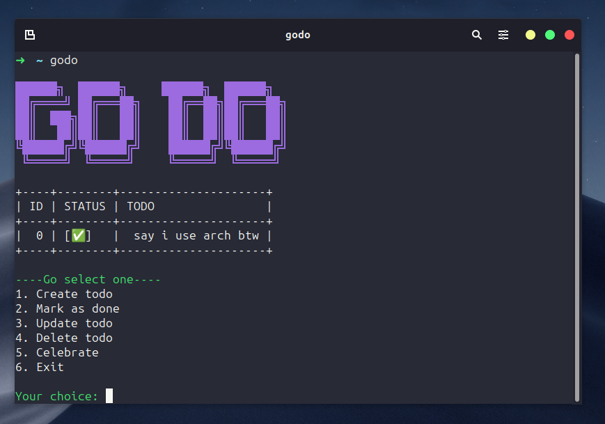

# Go-Do 

A simple CLI tool to manage your to-do list in the terminal ✍



## Installation

### Prerequisites

- Go and git installed on your machine

### Installation steps 🚶

1. clone the repo:

   ```bash
   git clone https://github.com/torexanovich/godo.git
   ```
2. cd to project directory
    ```bash
   cd godo
    ```
3. run the install script
    ```bash
   ./install.sh
    ```


## congrats 🎉
to use just type ```godo``` 

